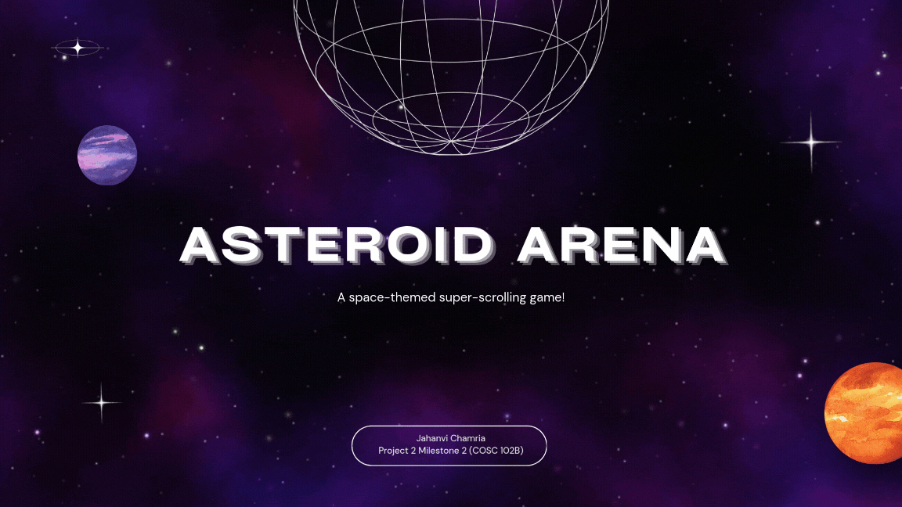

# Asteroid Arena

A four-level side-scrolling space shooter in Java. You fly a ship through three scrolling
gauntlets of asteroids and coins, then fight a stationary boss ship using ammunition you
had to collect in the earlier levels.

The resource design is the point. Fuel drains on a clock, so you cannot camp in a safe
corner. Coins are score in levels 1 through 3 and become bullets in level 4, so every coin
you skip early is a shot you do not have at the end. Reaching the boss with an empty wallet
is a loss condition.



## Running it

Java 17 or newer. From the repository root:

```
javac *.java
java Launcher
```

Run it from the repository root. Asset paths are relative to the working directory.

## Rules

### Objective

Clear three scrolling levels by score, then destroy the enemy ship.

### Controls

| Key | Action |
| --- | --- |
| Arrow keys | Move the ship |
| Mouse click | Fire a shot (final level only) |
| `Enter` | Advance a splash screen |
| `P` | Pause |
| `=` / `-` | Speed the game up or down, in steps of 20% (level 1 only) |
| `D` | Toggle the debug overlay |
| `Esc` | Quit |

### Your ship

Starts with 5 HP and 100% fuel, moves 7 pixels per keypress, and is 75x75 pixels.
Every level transition shrinks it by 25 pixels on each side, so the ship that reaches the
boss is smaller and harder to hit than the one that started.

### Entities

| Entity | Score | HP | Fuel | Size |
| --- | --- | --- | --- | --- |
| Collect (coin) | +20 | 0 | none | 75x75 |
| Rare Collect | +20 | +1 | refills to 100% | 50x50 |
| Avoid (asteroid) | 0 | -1 | none | 75x75 |
| Rare Avoid | -40 | -1 | **halves it** | 120x90 |
| Power-up | +10 | 0 | none | 40x40 |

Entities spawn every 45 ticks at a random height on the right edge, up to 3 at a time,
and never spawn overlapping something already on screen. A spawn is rare with probability
1 in 5 by default. Anything that scrolls off the left edge is garbage collected.

### Fuel

Fuel starts at 100% and drains 0.05% per tick for the whole of levels 1 through 3. It
refills completely at every level transition and on every Rare Collect. A Rare Avoid cuts
it in half. Fuel does not drain during the boss fight.

**Running out of fuel ends the game**, exactly like running out of HP.

### Levels

You advance when your score crosses 300 times your current level, so 300, then 600, then
900. Each transition resets your position, refills fuel, and clears the screen.

**Level 1.** The tutorial. You control the game speed with `=` and `-`, up to 300%.
Rare entities appear 1 spawn in 5.

**Level 2.** Speed control is locked out. Coins shrink to 50x50 and move faster.
Asteroids grow to 100x100 and move faster still. Up to 4 entities spawn at a time and
rare entities drop to 1 in 6. Smaller rewards, bigger hazards, denser field.

**Level 3.** The game runs at 150% speed. Power-ups enter the spawn pool and rare
entities climb to 1 in 4. Collecting a power-up shrinks your ship to 25x25 and drops the
speed back to 100% for four seconds, which is the only way to buy yourself time.

**Final level.** No scrolling spawns and no fuel drain. A 225x225 enemy ship parks at the
right edge with 100 HP and fires five small asteroids in a radial spread every 90 ticks.
Click to fire. **Each shot costs one coin you collected earlier**, deals 10 damage, and is
destroyed on contact with an incoming asteroid. Ten clean hits kill the boss.

### Winning and losing

You win by reducing the enemy ship to 0 HP.

You lose if your HP hits 0, your fuel hits 0, or you reach the boss and run out of
ammunition while it is still alive.

## What I wrote

This game is built on a 2D scrolling engine that was provided to me. 

**Mine.** The game itself.

- `AsteroidArena.java` (380 lines) is the whole game: the level system, the fuel economy,
  the power-up timer, the boss fight, the radial emission pattern, the shot collision
  resolution, the win and loss conditions, and the splash screen state machine.
- `PowerUp.java`, `Shot.java`, `SmallAvoid.java` are the entity types the game needed and
  the engine did not have. `SmallAvoid` carries its own X and Y velocity, which is what
  makes the boss able to fire in directions other than straight left.
- `Launcher.java` is a one-line entry point.
- Everything in `assets/`. The splash, rules, level, win, and loss screens are mine.
  Two sprites are credited under Attribution below.

**Provided.** The framework the game runs on, unmodified.

- `GameEngine2D.java` and `Window.java` are the engine and the Swing rendering layer.
  Both carry a do-not-modify banner and both still have it.
- `Entity.java`, `DisplayList.java`, `Player.java`, `Consumable.java`, `Scrollable.java`
  are the entity model.
- `Avoid.java`, `Collect.java`, `RareAvoid.java`, `RareCollect.java` are the four base
  entity types.
- `StarterGame.java` is a single-level demo game. `AsteroidArena` extends it and overrides
  most of it.

## Attribution

- Gas station icon, [pngtree](https://pngtree.com/freepng/gas-station-black-and-white_7765777.html)
- Rocket graphic, [Freepik](https://www.freepik.com/premium-vector/graphic-rocket-black-background_31080082.htm)
- Remaining graphics made in Canva
